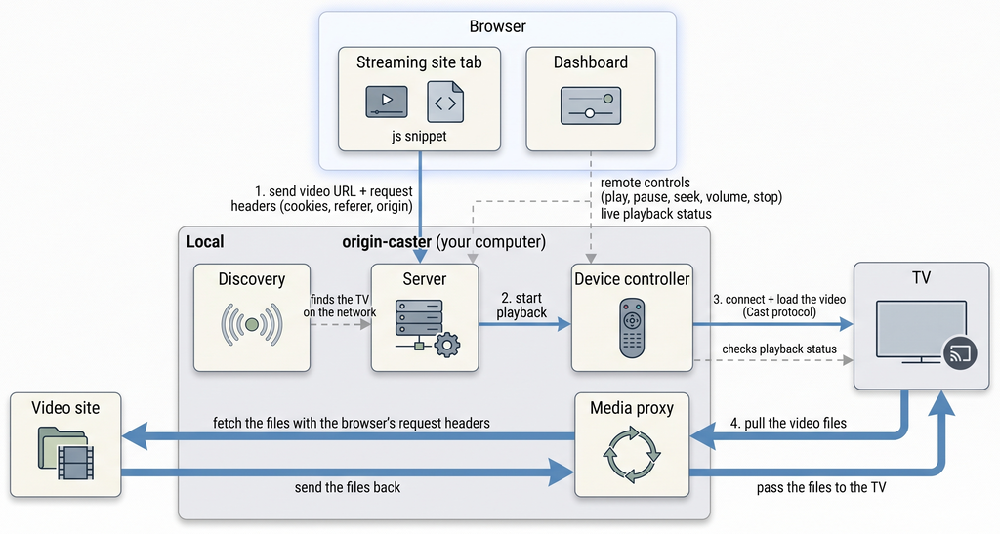

# origin-caster - Developer Guide

This is the developer guide for origin-caster: architecture, code layout, build/test commands, the REST API, and how the internal pieces work (browser snippet, media proxy, device controller).

For install, usage, and CLI flags, see [README.md](README.md).

## Concepts

Terms used throughout this document:

- **Sender** - the browser that starts playback (your Chrome tab).
- **Receiver** - the app on the TV that plays the video (the default media receiver on Chromecast / Android TV).
- **Cast V2** - Google's control protocol. Sender and receiver talk over TLS; messages include `LAUNCH` and `LOAD`.
- **mDNS / DNS-SD** - LAN discovery: devices advertise and find each other by name and service type.
- **HLS** - a video format: a playlist (`.m3u8`) plus many small segment files, optionally AES-128 encrypted.
- **DASH** - a similar format: a manifest (`.mpd`) plus segments.

## Architecture & data flow

The diagram shows what runs where: a web browser, origin-caster on the local machine, the physical TV, and the upstream media site.

<p align="center">
  
</p>

### Ports

origin-caster runs one network service of its own:

| Port | Service | Protocol | Who connects to it | Flag to change it |
|------|---------|----------|--------------------|-------------------|
| 8888 | Dashboard + media proxy | HTTP | Your browser (dashboard), the TV (video) | `-http-addr` |

Port 8888 must be reachable from both your browser and the TV.

## Codebase layout

```
├── cmd/
│   └── origin-caster/       # CLI entrypoint and lifecycle
├── internal/                # App-private packages (not importable from outside the module)
│   ├── castproto/           # Cast V2 wire framing + protobuf encode/decode
│   ├── controller/          # Direct device controller (Cast V2 client to the TV)
│   ├── mdns/                # mDNS discovery scanner for the physical TV
│   ├── proxy/               # Media proxy: upstream fetch, header injection, HLS rewriter
│   ├── server/              # Web dashboard, REST API, snippet serving (mounts the proxy)
│   └── netutil/             # LAN IP detection
├── web/                     # Public web content & browser snippet (embedded via web/embed.go)
│   ├── embed.go             # //go:embed index.html app.js style.css cast.js
│   ├── index.html, style.css, app.js   # Dashboard UI
│   ├── cast.js              # Browser extraction snippet (readable, modular source)
│   └── cast.test.js         # Node unit tests for the snippet
├── Makefile                 # Build, test, and development automation
├── go.mod
└── README.md
```

## Development workflow

| Command | What it does |
|---|---|
| `make build` | Compile the binary to `bin/origin-caster` |
| `make test` | Run all Go unit and integration tests |
| `make test-js` | Run the browser-snippet unit tests (`web/cast.test.js`, Node VM + fake DOM); separate from the Go suite |
| `make test-coverage` | Run Go tests with a coverage report |
| `make vet` | Run `go vet` linter |
| `make run` | Build and run |
| `make list` | Scan and print discovered Cast devices on LAN |
| `make chrome-dev` | Launch an isolated Chrome instance for DevTools stream inspection (port 9222) |
| `make install` | Install the binary to `GOPATH/bin` |
| `make clean` | Remove build artifacts |
| `make help` | List all targets |

## REST API

The local server (port 8888) provides these endpoints:

| Endpoint | Method | Description | Request payload / query |
|---|---|---|---|
| `/api/cast` | `GET`, `POST` | Send a media URL + request headers to the physical TV. Dashboard uses `POST` + JSON; the snippet uses a `GET` popup navigation with query params (or `POST` form). `OPTIONS` (CORS preflight) is handled; 400 if `url` is missing; 503 if no TV controller is attached. Response: `GET` -> auto-closing HTML page for popup navigations (`Accept: text/html`), otherwise a 1x1 GIF (Image beacon); `POST` -> auto-closing HTML page for form navigations, otherwise JSON | JSON body or query/form fields: `url` (required), `title`, `referer`, `origin`, `cookies`, `userAgent`, `contentType`, `currentTime`, `headers` (JSON map). The browser's `User-Agent` is captured from the request header when not supplied |
| `/api/play` | `POST` | Resume playback on the TV; returns `{"status":"ok","action":"play"}` | None |
| `/api/pause` | `POST` | Pause playback on the TV | None |
| `/api/seek` | `POST` | Seek to an absolute second or a relative delta, clamped to `[0, duration]` | `?seconds=120` or `?delta=-10` (query or form body) |
| `/api/volume` | `POST` | Set receiver volume level and mute status; `muted` accepts `true`/`1` | `?level=0.8&muted=false` (query or form body) |
| `/api/stop` | `POST` | Stop playback and release the receiver session | None |
| `/api/stats` | `GET` | Live JSON metrics and playback state | None - returns `total_requests`, `total_bytes`, `active_streams`, `m3u8_rewrites`, `base_url`, `playback`, `active_session` |
| `/health` | `GET` | Liveness check | None - returns `{"status":"ok","time":"<RFC3339>"}` |
| `/proxy` | `GET` | The path the TV fetches media through. The proxy downloads each file from the streaming site adding the browser's request headers (cookies, referer, origin, user-agent) and hands it to the TV. See [Media proxy](#media-proxy) for details | `?url=<real-media-url>` (optionally `&origin=`, `&referer=`, `&headers=` JSON) |

## Browser extraction snippet

### Why a snippet at all

Streaming sites play video with a small program called a **player** (hls.js, Video.js, dash.js, Plyr, Bitmovin, THEOplayer, ...). To cast, origin-caster needs the video's real URL, which is hidden inside the player. The snippet is JavaScript the user pastes into the site's DevTools console; it reads the URL with **detectors** - small functions, one per player.

### Why the copy button gives one long script

The streaming site is a public website; origin-caster may run on the same machine as the browser (localhost). For safety, browsers stop public websites from reaching your machine - otherwise any website could access your local devices. This protection is called Local Network Access (LNA; previously Private Network Access, PNA), and CORS headers cannot override it.

Since Chrome version 142 it blocks script and API loading (fetch, XHR, script tags) from public sites to localhost; since version 147 it also blocks WebSocket connections. Only opening a new page or popup (top-level navigation) stays allowed - that is why the snippet casts via `window.open()`. The **Copy Extraction Snippet** button therefore copies the full minified script.

### How the snippet is built and served

The readable, modular detector framework lives in `web/cast.js`. It is embedded into the binary with `//go:embed` at compile time, minified at startup, and injected into the dashboard (`web/app.js`).

### How detection works

The snippet runs once as a pipeline:

1. **Snapshot** - one-shot snapshot of every `<video>` (sorted by activity, so ad/teaser players rank last) plus the performance resource list.
2. **Layered detectors** - player brands -> engine reference scan (hls.js / dash.js / shaka / flv.js) -> generic HTML5 -> network scan.
3. **Score and merge** - candidates from all layers are scored; the best wins wholesale (a URL from one detector is never mixed with a time from another).

To add a supported player: implement a detector function in the appropriate layer in `cast.js`, add a fixture to `web/cast.test.js`, run `make build`, and restart the server.

### Detector rules

- **No `blob:` URLs** - if the `<video>` plays via MSE, return the real manifest from the attached engine (`hls.url`, `getSource()`, ...).
- **Return a candidate** `{ url, type?, time?, player?, layer? }` or `null`; the merger scores whole candidates (exact player/engine URLs and active-`<video>` candidates win).

## Media proxy

### The problem

Some streaming sites lock video delivery to a browser session: requests must carry the right cookies, `Referer`/`Origin` headers, and user-agent.
The TV fails these checks, so it cannot play the video directly.

### The solution

origin-caster runs a small web server (the media proxy) that fetches video **for** the TV:

1. When you press Cast, the browser sends the video URL plus its request headers (cookies, referer, origin, user-agent) to the server. The server stores them as-is and never inspects their contents.
2. The server tells the TV to play a special URL that points to our server instead of the media site.
3. The TV asks our server for the video. Our server asks the media site, adding the browser's request headers to the request. The media site thinks a browser is downloading the video, so it allows it.
4. Our server passes the video back to the TV.

The TV never talks to the media site directly. It only talks to our server, so it never needs the browser's request headers itself.

### The `/proxy` endpoint

Every media request from the TV goes to `/proxy`, e.g. `http://localhost:8888/proxy?url=https://media.example.com/video.mp4`. The `url` parameter holds the real file the TV wants; relative links are resolved automatically against `origin`/`referer`.

To each request the proxy adds the browser's request headers (cookies, referer, origin, user-agent), passed through as-is. Seeking works too: the TV's range requests are passed through. Extra query params (`&origin=`, `&referer=`, `&headers=`) can override or add headers for a single request.

HLS videos are split into many small files: first the TV fetches a playlist (`.m3u8`) that lists all the other files (video chunks, audio, encryption keys). The proxy rewrites this playlist so that **every** item in it also points back to `/proxy`. That way the TV keeps fetching through our server for the whole video. AES-128 keys are relayed the same way - the TV decrypts, the proxy never does.

## Protocol internals

Protocol references:
- **Google Cast** - [developer docs](https://developers.google.com/cast/docs), [open-source implementation (openscreen)](https://github.com/chromium/openscreen)
- **mDNS / DNS-SD** - [RFC 6762](https://datatracker.ietf.org/doc/html/rfc6762) / [RFC 6763](https://datatracker.ietf.org/doc/html/rfc6763)
- **HLS** - [RFC 8216](https://datatracker.ietf.org/doc/html/rfc8216)

### Device discovery

Runs over mDNS (UDP 5353): origin-caster scans `_googlecast._tcp` to find the physical TV. If the TV cannot be found (or is on another subnet), point at it directly with `-tv-ip`.

### Device controller

- Talks Cast V2 directly to the physical TV over TLS (skipping certificate verification - the TV presents a Google Cast certificate that the controller is not expected to validate).
- Runs the receiver lifecycle itself: `CONNECT` -> `LAUNCH` (default media receiver, `CC1AD845`) -> `CONNECT` to the app transport -> `LOAD` with the media URL rewritten through the local proxy.
- Answers its own heartbeats and polls media status so the dashboard can show live playback state.

### HLS / AES-128 playlist rewriter

- Intercepts master manifests and media playlists (`.m3u8`).
- Rewrites segment URIs, variant stream URLs, subtitles, and audio tracks to proxy endpoints (`/proxy?url=...`).
- Rewrites `#EXT-X-KEY` decryption URIs so physical receivers fetch AES-128 keys through the proxy using the browser's request headers.
- Handles disguised chunk streams (e.g. `.png` disguised TS/AAC chunks).
