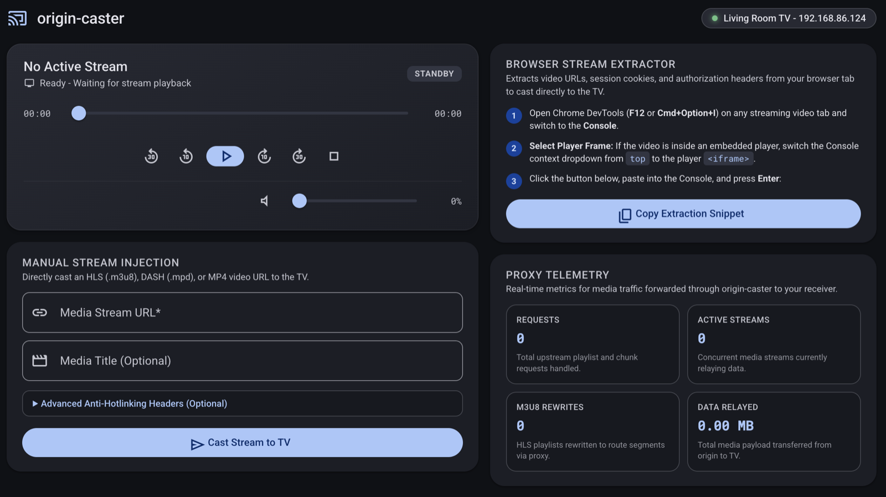

# origin-caster

Cast videos from sites without native Cast support to your Chromecast or Android TV.

Some streaming sites lock video delivery to a browser session: requests must carry the right cookies, `Referer`/`Origin` headers, and user-agent, which a Chromecast cannot present. Origin-caster bridges that gap with a local proxy: it captures the active stream URL together with the browser's request headers and relays them unchanged, making the TV's requests look exactly like the browser's.

## Quickstart

### 1. Run
```bash
# Start origin-caster
./bin/origin-caster -tv-name "Living Room TV"
```

Note that origin-caster exposes a web dashboard and media proxy on `http://localhost:8888` (or the address you specify with `-http-addr`)
without authentication. Do not use it on a public network.

### 2. Cast from Any Browser Tab
1. Open the video on any streaming website.
2. Open Chrome DevTools (**F12** or **Cmd+Option+I**) and switch to the **Console** tab.
3. If the video player is embedded, select the player `<iframe>` from the Console dropdown (defaults to `top`).
4. Open **http://localhost:8888** in your browser, click **Copy Extraction Snippet**, paste it into the Console, and press **Enter**.
5. Playback starts on the TV with live remote controls (play, pause, seek, volume) on the web dashboard (launch takes a few seconds; Android TV can take up to ~20 s).



## CLI Options

| Flag | Default | Description |
|------|---------|-------------|
| `-http-addr` | `:8888` | Address (host:port) of the web dashboard and media proxy. You open the dashboard here; the TV fetches video here. `:8888` listens on all interfaces and advertises the detected LAN IP. To force an address, give a host, e.g. `-http-addr 192.168.1.50:8888` - the TV must be able to reach it |
| `-lan-ip` | auto-detected | LAN IP advertised in the proxy URL handed to the TV. Set it if auto-detection picks the wrong network |
| `-tv-name` | `""` | Pick the physical TV by name (case-insensitive substring), e.g. `-tv-name "Living Room TV"` |
| `-tv-ip` | `""` | IP address of the physical TV. Auto-discovered if empty |
| `-tv-port` | `8009` | Port of the physical TV's Cast V2 service. Only needed if the TV uses a non-standard port |
| `-list` | `false` | Scan the LAN for Chromecast devices, print them, and exit |
| `-scan-timeout` | `3s` | Timeout for the device scan |
| `-log-file` | `""` | Also write logs to this file (default: stderr only) |
| `-v` / `-verbose` | `false` | Verbose protocol logging |

## Development & Architecture

For architecture diagrams, REST API documentation, protocol internals, and contribution guidelines, see [CONTRIBUTING.md](CONTRIBUTING.md).
