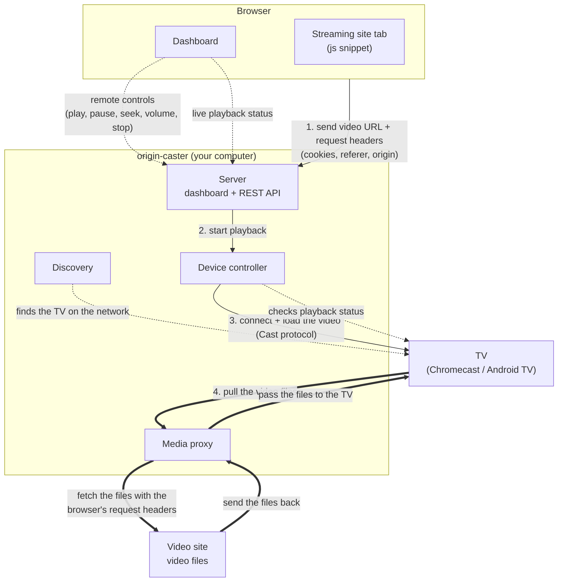

```mermaid
flowchart TD

    subgraph Browser["Browser"]
        SNIP["Streaming site tab<br/>(js snippet)"]
        DASH["Dashboard"]
    end

    subgraph Local["origin-caster (your computer)"]
        MDNS["Discovery"]
        API["Server<br/>dashboard + REST API"]
        CTRL["Device controller"]
        PROXY["Media proxy"]
    end

    TV["TV<br/>(Chromecast / Android TV)"]
    SITE["Video site<br/>video files"]

    MDNS -.->|"finds the TV on the network"| TV
    Browser -->|"1. send video URL + request headers<br/>(cookies, referer, origin)"| API
    API -->|"2. start playback"| CTRL
    CTRL -->|"3. connect + load the video (Cast protocol)"| TV
    TV ==>|"4. pull the video files"| PROXY
    PROXY ==>|"fetch the files with the<br/>browser's request headers"| SITE
    SITE ==>|"send the files back"| PROXY
    PROXY ==>|"pass the files to the TV"| TV

    DASH -.->|"remote controls<br/>(play, pause, seek, volume, stop)"| API
    DASH -.->|"live playback status"| API
    CTRL -.->|"checks playback status"| TV
```
